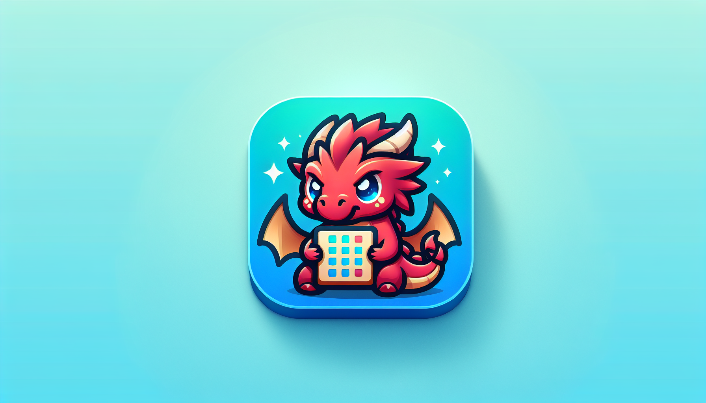

<div id="top">

<!-- HEADER STYLE: CLASSIC -->
<div align="center">



# CRITS-N-SHITS

<em>Unleash Your Inner Strategist with Seamless Exploration</em>

<!-- BADGES -->


<em>Built with the tools and technologies:</em>


</div>
<br>

---

## 📄 Table of Contents

- [Overview](#-overview)
- [Getting Started](#-getting-started)
    - [Prerequisites](#-prerequisites)
    - [Installation](#-installation)
    - [Usage](#-usage)
    - [Testing](#-testing)
- [Features](#-features)
- [Project Structure](#-project-structure)
    - [Project Index](#-project-index)
- [Roadmap](#-roadmap)

---

## ✨ Overview

Crits n Shits is an open-source web platform tailored for exploring and managing a rich library of games, images, and event schedules. Built with modern frontend tools, it emphasizes interactivity, customization, and seamless user experience.

**Why Crits n Shits?**

This project streamlines the development of dynamic, styled web interfaces for gaming communities and event organizers. The core features include:

- 🧩 **🔍 Search & Sort:** Efficiently browse and filter collections of war games, board games, RPGs, and images.
- 🎨 **🖌️ Custom Styling:** Leverage Tailwind CSS and PostCSS for a consistent, branded UI.
- ⚙️ **Modular Architecture:** Clear component interactions facilitate easy maintenance and onboarding.
- 📡 **Dynamic Data:** Fetch and update content in real-time for an engaging user experience.
- 📱 **Responsive Design:** Adapt layouts and functionalities for mobile and desktop environments.

---

## 📌 Features

|      | Component            | Details                                                                                     |
| :--- | :------------------- | :------------------------------------------------------------------------------------------ |
| ⚙️  | **Architecture**     | <ul><li>Client-side rendered with static assets</li><li>Uses modular JavaScript components</li></ul> |
| 🔩 | **Code Quality**     | <ul><li>Consistent code style with ESLint</li><li>Uses modern JavaScript syntax (ES6+)</li></ul> |
| 📄 | **Documentation**    | <ul><li>Basic README with project overview</li><li>Inline comments in codebase</li></ul> |
| 🔌 | **Integrations**      | <ul><li>FullCalendar for calendar features</li><li>Tailwind CSS for styling</li><li>PostCSS for CSS processing</li></ul> |
| 🧩 | **Modularity**        | <ul><li>Separate modules for calendar, styling, and utilities</li><li>Uses ES modules import/export</li></ul> |
| 🧪 | **Testing**           | <ul><li>No explicit testing framework detected</li><li>Potential for manual testing or future unit tests</li></ul> |
| ⚡️  | **Performance**       | <ul><li>Optimized with Tailwind CSS purge</li><li>Uses Vite for fast development build</li></ul> |
| 🛡️ | **Security**          | <ul><li>No evident security features or vulnerabilities</li><li>Client-side only, minimal attack surface</li></ul> |
| 📦 | **Dependencies**      | <ul><li>Relies on npm packages like @fullcalendar/core, tailwindcss, vite, autoprefixer</li><li>Uses package.json for dependency management</li></ul> |

---

## 📁 Project Structure

```sh
└── crits-n-shits/
    ├── README.md
    ├── boardgames-full.html
    ├── gallery-full.html
    ├── index.html
    ├── package-lock.json
    ├── package.json
    ├── postcss.config.cjs
    ├── rpg-full.html
    ├── src
    │   ├── main.js
    │   ├── pages
    │   └── style.css
    ├── tailwind.config.cjs
    ├── vite.config.js
    └── wargames-full.html
```

---

### 📑 Project Index

<details open>
	<summary><b><code>CRITS-N-SHITS/</code></b></summary>
	<!-- __root__ Submodule -->
	<details>
		<summary><b>__root__</b></summary>
		<blockquote>
			<div class='directory-path' style='padding: 8px 0; color: #666;'>
				<code><b>⦿ __root__</b></code>
			<table style='width: 100%; border-collapse: collapse;'>
			<thead>
				<tr style='background-color: #f8f9fa;'>
					<th style='width: 30%; text-align: left; padding: 8px;'>File Name</th>
					<th style='text-align: left; padding: 8px;'>Summary</th>
				</tr>
			</thead>
				<tr style='border-bottom: 1px solid #eee;'>
					<td style='padding: 8px;'><b><a href='https://github.com/WoLand-Q/crits-n-shits/blob/master/wargames-full.html'>wargames-full.html</a></b></td>
					<td style='padding: 8px;'>- Provides an interactive webpage for browsing, searching, and sorting a library of war games<br>- It enables users to efficiently locate specific games by title, description, or tags, and organize results based on criteria like name, number of players, or duration<br>- This page serves as the user interface layer, facilitating seamless access to the underlying game data within the broader application architecture.</td>
				</tr>
				<tr style='border-bottom: 1px solid #eee;'>
					<td style='padding: 8px;'><b><a href='https://github.com/WoLand-Q/crits-n-shits/blob/master/README.md'>README.md</a></b></td>
					<td style='padding: 8px;'>- Provides an overview of the projects architecture, outlining the core components and their interactions<br>- It clarifies the overall purpose and how different modules integrate to deliver the applications functionality, serving as a guide for understanding the system's structure and facilitating onboarding and maintenance efforts.</td>
				</tr>
				<tr style='border-bottom: 1px solid #eee;'>
					<td style='padding: 8px;'><b><a href='https://github.com/WoLand-Q/crits-n-shits/blob/master/tailwind.config.cjs'>tailwind.config.cjs</a></b></td>
					<td style='padding: 8px;'>- Defines the design systems visual styling and typography customization for the project, ensuring consistent appearance across web pages<br>- It specifies the content sources for style application and extends default themes with custom fonts, supporting a cohesive and branded user interface within the overall architecture.</td>
				</tr>
				<tr style='border-bottom: 1px solid #eee;'>
					<td style='padding: 8px;'><b><a href='https://github.com/WoLand-Q/crits-n-shits/blob/master/package.json'>package.json</a></b></td>
					<td style='padding: 8px;'>- Defines project metadata, dependencies, and scripts for development, building, and previewing the web application<br>- It orchestrates the integration of Tailwind CSS, Vite, and FullCalendar components, enabling a streamlined development workflow and ensuring consistent setup across environments<br>- Serves as the foundational configuration that supports the overall architecture of a modern, interactive web interface.</td>
				</tr>
				<tr style='border-bottom: 1px solid #eee;'>
					<td style='padding: 8px;'><b><a href='https://github.com/WoLand-Q/crits-n-shits/blob/master/vite.config.js'>vite.config.js</a></b></td>
					<td style='padding: 8px;'>- Configures the development environment for the project by integrating Tailwind CSS with Vite, enabling efficient styling workflows<br>- It also sets up hot module replacement with overlay support to enhance developer experience during local development sessions<br>- Overall, it streamlines the build process and ensures a smooth, responsive development environment aligned with the projects architecture.</td>
				</tr>
				<tr style='border-bottom: 1px solid #eee;'>
					<td style='padding: 8px;'><b><a href='https://github.com/WoLand-Q/crits-n-shits/blob/master/gallery-full.html'>gallery-full.html</a></b></td>
					<td style='padding: 8px;'>- Provides a full-page gallery interface showcasing event and gaming photos with search and sorting capabilities<br>- Facilitates image viewing in a modal overlay, enhancing user engagement and navigation within the overall website architecture<br>- Serves as the primary visual content presentation layer, integrating styling and interactive functionalities to deliver an immersive gallery experience.</td>
				</tr>
				<tr style='border-bottom: 1px solid #eee;'>
					<td style='padding: 8px;'><b><a href='https://github.com/WoLand-Q/crits-n-shits/blob/master/index.html'>index.html</a></b></td>
					<td style='padding: 8px;'>- This <code>index.html</code> file serves as the main entry point for the web application of the Crits n Shits gaming club<br>- It establishes the foundational structure and visual styling for the site, providing essential metadata for search engine optimization and social sharing<br>- Overall, it delivers the initial user interface and sets the stage for the site's content, enabling visitors to access information about the club's schedule, games, masters, gallery, and rules within the broader web architecture.</td>
				</tr>
				<tr style='border-bottom: 1px solid #eee;'>
					<td style='padding: 8px;'><b><a href='https://github.com/WoLand-Q/crits-n-shits/blob/master/boardgames-full.html'>boardgames-full.html</a></b></td>
					<td style='padding: 8px;'>- Provides a user interface for browsing, searching, and sorting a collection of board games within the Crits n Shits catalog<br>- Facilitates easy navigation and filtering of game entries by title, description, tags, players, and playtime, integrating with the overall web application architecture to enhance user experience in exploring the library of board games.</td>
				</tr>
				<tr style='border-bottom: 1px solid #eee;'>
					<td style='padding: 8px;'><b><a href='https://github.com/WoLand-Q/crits-n-shits/blob/master/rpg-full.html'>rpg-full.html</a></b></td>
					<td style='padding: 8px;'>- Provides a web interface for browsing, searching, and sorting a library of RPG-related content within the Crits n Shits project<br>- It facilitates user interaction with the library by enabling dynamic filtering and organization of items based on criteria like title, players, and duration, supporting an intuitive exploration experience aligned with the overall catalog architecture.</td>
				</tr>
				<tr style='border-bottom: 1px solid #eee;'>
					<td style='padding: 8px;'><b><a href='https://github.com/WoLand-Q/crits-n-shits/blob/master/postcss.config.cjs'>postcss.config.cjs</a></b></td>
					<td style='padding: 8px;'>- Configures PostCSS to integrate Tailwind CSS and Autoprefixer, streamlining the styling process within the project<br>- It ensures consistent application of utility-first CSS and automatic vendor prefixing, supporting a cohesive and compatible frontend architecture<br>- This setup enhances maintainability and cross-browser compatibility across the entire codebase.</td>
				</tr>
			</table>
		</blockquote>
	</details>
	<!-- src Submodule -->
	<details>
		<summary><b>src</b></summary>
		<blockquote>
			<div class='directory-path' style='padding: 8px 0; color: #666;'>
				<code><b>⦿ src</b></code>
			<table style='width: 100%; border-collapse: collapse;'>
			<thead>
				<tr style='background-color: #f8f9fa;'>
					<th style='width: 30%; text-align: left; padding: 8px;'>File Name</th>
					<th style='text-align: left; padding: 8px;'>Summary</th>
				</tr>
			</thead>
				<tr style='border-bottom: 1px solid #eee;'>
					<td style='padding: 8px;'><b><a href='https://github.com/WoLand-Q/crits-n-shits/blob/master/src/main.js'>main.js</a></b></td>
					<td style='padding: 8px;'>- This code file serves as the main entry point for the applications front-end, orchestrating the initialization and configuration of an interactive calendar feature<br>- It integrates various calendar views and plugins, including Google Calendar synchronization, to provide users with a dynamic and responsive scheduling interface<br>- The code adapts the calendar layout based on device type, ensuring an optimal user experience across mobile and desktop environments<br>- Overall, it establishes the core calendar functionality within the broader application architecture, enabling seamless event display and user interaction.</td>
				</tr>
			</table>
			<!-- pages Submodule -->
			<details>
				<summary><b>pages</b></summary>
				<blockquote>
					<div class='directory-path' style='padding: 8px 0; color: #666;'>
						<code><b>⦿ src.pages</b></code>
					<table style='width: 100%; border-collapse: collapse;'>
					<thead>
						<tr style='background-color: #f8f9fa;'>
							<th style='width: 30%; text-align: left; padding: 8px;'>File Name</th>
							<th style='text-align: left; padding: 8px;'>Summary</th>
						</tr>
					</thead>
						<tr style='border-bottom: 1px solid #eee;'>
							<td style='padding: 8px;'><b><a href='https://github.com/WoLand-Q/crits-n-shits/blob/master/src/pages/gallery-full.js'>gallery-full.js</a></b></td>
							<td style='padding: 8px;'>- Provides an interactive full-screen gallery with search and sorting capabilities, enabling users to browse, filter, and view images seamlessly<br>- Implements dynamic data fetching, image modal display, and animated transitions to enhance user experience<br>- Integrates with the overall site architecture by sourcing assets relative to the base URL and updating the DOM based on user interactions.</td>
						</tr>
						<tr style='border-bottom: 1px solid #eee;'>
							<td style='padding: 8px;'><b><a href='https://github.com/WoLand-Q/crits-n-shits/blob/master/src/pages/full-list.js'>full-list.js</a></b></td>
							<td style='padding: 8px;'>- Provides dynamic rendering and interactive filtering of game collections, supporting multiple categories such as boardgames, RPGs, and wargames<br>- Facilitates data fetching, normalization, and user-driven sorting and searching, enabling users to browse and discover game options efficiently within the broader application architecture<br>- Enhances user experience through real-time updates and flexible data handling.</td>
						</tr>
					</table>
				</blockquote>
			</details>
		</blockquote>
	</details>
</details>

---

## 🚀 Getting Started

### 📋 Prerequisites
- **Node.js**: Vite 7 requires **Node 20.19+ or 22.12+** (or newer).  
  Docs: https://vite.dev/guide/migration.html#node-js-support
- **npm**: comes with Node (this repo uses npm + `package-lock.json`).
- **Git**: for cloning.

Optional but handy:
- **nvm** (macOS/Linux) / **nvm-windows** for switching Node versions quickly.

### ⚙️ Installation
Clone the repository:

```sh
git clone <repo-url>
cd <repo-folder>
```

Install dependencies:

```sh
npm install
```

Run the dev server:

```sh
npm run dev
```

**Clean reinstall (recommended after dependency changes / branch switches)**

- **macOS / Linux**

```sh
rm -rf node_modules package-lock.json
npm install
```

- **Windows (PowerShell)**

```powershell
Remove-Item -Recurse -Force node_modules, package-lock.json
npm install
```

- **Windows (CMD)**

```bat
rmdir /s /q node_modules
del package-lock.json
npm install
```

**CI / deterministic installs**

If you’re running this in CI (or want a lockfile-faithful install):

```sh
npm ci
```

### 💻 Usage

Run the project with:

**Using [npm](https://www.npmjs.com/):**

```sh
npm run dev
```


### 🧱 Build

Create an optimized production build:

```bash
npm run build
```

The output will be in `dist/`.

### 🔎 Preview the production build locally

```bash
npm run preview
```

By default Vite will print the local URL (commonly `http://localhost:4173`).

### 🚢 Production / Deployment
This project builds to a static site in `dist/` (Vite default). A typical production flow:

1. Build on your machine / CI:
   ```sh
   npm ci
   npm run build
   ```
2. Upload the **contents of `dist/`** to your server / hosting.
3. Serve it with any static server (Nginx, Caddy, Cloudflare Pages, Netlify, etc.).

**Nginx example (SPA-friendly)**

```nginx
server {
  listen 80;
  server_name your-domain.com;

  root /var/www/your-app/dist;
  index index.html;

  location / {
    try_files $uri $uri/ /index.html;
  }
}
```

Notes:
- You need `devDependencies` only for the **build step**. In production you typically just serve `dist/` (no Node runtime required).
- If your app uses a non-root base path, set Vite’s `base` option accordingly before building.

### 🩹 Troubleshooting
**Vite / PostCSS error: `Cannot find module '@tailwindcss/postcss'`**

What it means: PostCSS is trying to load Tailwind’s PostCSS plugin, but it’s not installed (or `devDependencies` were skipped).

Docs (Tailwind v4 beta): https://v3.tailwindcss.com/docs/v4-beta

Fix checklist:

1) Make sure you didn’t install *without* dev deps:
- avoid `npm install --omit=dev` / `npm ci --omit=dev` for local dev/build
- also check that you’re not globally forcing `NODE_ENV=production` during install/build

2) Clean reinstall (most common fix)

- **Windows (PowerShell)**
```powershell
Remove-Item -Recurse -Force node_modules, package-lock.json
npm install
```

- **macOS / Linux**
```sh
rm -rf node_modules package-lock.json
npm install
```

3) If it still complains, explicitly add the plugin and reinstall:

```sh
npm install -D @tailwindcss/postcss
```

Also double-check you’re using a supported Node version (see **Prerequisites**) and that you’re running commands in the project root (where `package.json` is).

### 🧪 Testing

Tests are not configured in this repository yet.


## 📈 Roadmap

- [X] **`Task 1`**: <strike>Implement feature one.</strike>
- [ ] **`Task 2`**: Implement feature two.
- [ ] **`Task 3`**: Implement feature three.

---

<div align="left"><a href="#top">⬆ Return</a></div>

---
